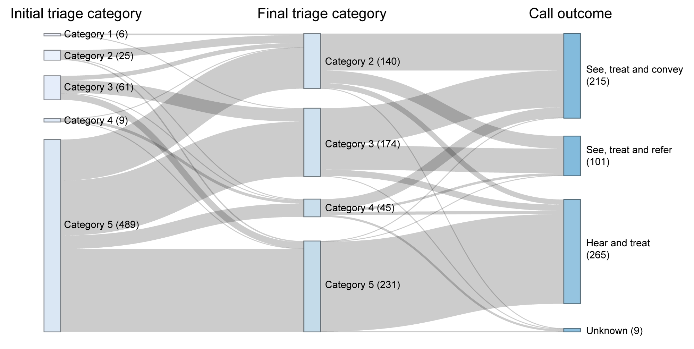

# Results {-}

```{r results, echo=F, message=F, warning=F}
  # Use pandoc for Word documents
  format="pandoc"

knitr::opts_chunk$set(echo = F, message = F, warning = F, cache = F, fig.align = 'center', out.width = '90%', fig.width = 10)

# https://stackoverflow.com/questions/14733732/cant-change-fonts-in-ggplot-geom-text
#windowsFonts(Times=windowsFont("TT Arial"))

library(tidyverse)
library(lubridate)
library(tableone)
library(readxl)
library(yardstick)

ampds_df <- data.frame(
  code = c("01", "02", "03", "04", "05", "06", "07", "08", "09", "10", "11", "12", "13", "14", "15", "16", "17", "18", "19", "20", "21", "22", "23", "24", "25", "26", "27", "28", "29", "30", "31", "32", "33", "34", "35", "36", "37"),
  code_num = seq(1, 37, 1),
  code_text = c("Abdominal pain/problems", "Allergies", "Animal bites/attacks", "Assault", "Back pain", "Breathing problems", "Burns", "Carbon monoxide/Inhalation/HAZMAT/CBRN", "Cardiac or respiratory arrest/death", "Chest pain", "Choking", "Covulsions/fitting", "Diabetic problems", "Drowning", "Electrocution", "Eye problems", "Falls", "Headache", "Heart problems", "Heat/cold exposure", "Haemorrhage/lacerations", "Inaccessible incident", "Overdose/poisoning", "Pregnancy/Childbirth/Miscarriage", "Psychiatric", "Sick person", "Stab/gunshot/penetrating trauma", "Stroke/TIA", "Traffic incident", "Traumatic injuries", "Unconscious", "Unknown problem", "Transfer", "ACN", "Health Care Professional Admission", "Pandemic", "Interfacility"),
  stringsAsFactors = F
)

df <- readRDS('data/df-final.rds')

df1 <- df %>%
  filter(
    TimeCallCommenced >= ymd('2020-03-26'),
    TimeCallCommenced <= ymd('2020-08-26')            
  ) %>%
  left_join(ampds_df, by=c("ampds_cc"="code")) %>%
  mutate(
    vt_isoweek = isoweek(TimeCallCommenced),
    month = month(TimeCallCommenced, label = T, abbr = T),
    advisor_id = factor(advisor_id),
    week_comm = as.Date(floor_date(TimeCallCommenced, unit = "week", week_start = 1)),
    ampds_top = fct_lump(code_text, n = 14),
    video = ifelse(is.na(video), "unknown", video),
    `video call conducted?` = factor(case_when(
      is.na(unable) ~ "yes",
      tolower(unable) == "strongly disagree" ~ "unknown",
      TRUE ~ paste0("no: ",tolower(unable)))
    ),
    tech_issue = ifelse(is.na(tech_iss) | `video call conducted?` != "yes", "No", "Yes"),
    cat = ifelse(cat == 0, NA, cat),
    GovtStdTOC = str_sub(GovtStdTOC, 4,4)
  ) %>%
  rename(
    `initial triage category` = cat,
    `final triage category` = GovtStdTOC,
    `technical issue during call?` = tech_issue,
    `AMPDS chief complaint` = ampds_top,
    `call outcome` = call_outcome
  )

df1 %>%
  select(video, `call outcome`, `initial triage category`, `final triage category`, `AMPDS chief complaint`, `video call conducted?`, `technical issue during call?`) %>% saveRDS('data/sankey_df.rds')


summary_table <- CreateTableOne(
  vars = c("month", "CBU","original call category", "final call category", "age", "sex", "video call conducted?", "technical issue during call?", "AMPDS chief complaint", "call outcome"),
  strata = "video",
  data = df1, 
  test = F,
  factorVars = c("CBU", "technical issue during call?", "original call category", "final call category", "AMPDS chief complaint", "sex", "month", "video call conducted?", "call outcome"),
  addOverall = T,
  includeNA = T
)


```

## Summary of patient responses

```{r pt-responses}

library(likert)

createPlot <- function(dataframe,thelegend=FALSE, wrapwidth=40) {
  
  dataframe = as.data.frame(dataframe)
  
  leg = c(1000,1000)
  if(thelegend == TRUE) {
    leg = "bottom"
  }
  plot <- plot(likert(dataframe), type="bar", wrap=wrapwidth, include.center=T, plot.percents=F,plot.percent.low=T, plot.percent.high=T, plot.percent.neutral=T, legend.position=leg, colors=c('#CC0016','#F6A57F','#DFDFDF','#90C5DF','#0070B2')) 
  return(plot)
}

responses <- tolower(c("Strongly Disagree", "Disagree", "Neutral", "Agree", "Strongly Agree"))
 
 qns <- c("It was easy to get the video call to work", "My reason for calling was appropriate to be assess by video call", "The clinician I spoke with on the video call had a professional manner", "The clinician I spoke with supported me to use the video call technology", "Compared to telephone alone, the video call allowed me to express all my needs in a better way", "I was happy with the plan agreeed at the end of the video call", "Overall, I was satisfied with the video call")

pt_df <- read_xlsx('data/Video-Triage-Patient-Responses.xlsx') %>%
  select(q1:q7) %>%
  mutate_all(tolower) %>%
  filter_all(all_vars(. %in% responses)) %>%
  mutate_all(~ordered(.,levels = responses))

colnames(pt_df) <- qns

Qn8 <- read_xlsx('data/Video-Triage-Patient-Responses.xlsx') %>%
  select(q8)

#q8_respond <- Qn8 %>% count(!is.na(q8)) %>% filter(`!is.na(q8)` == TRUE) %>% pull(n)
q8_respond <- Qn8 %>% summarise(n = n(), resp = sum(!is.na(q8)))
prop_respond <- round((q8_respond$resp/q8_respond$n)*100,1)

# Create summary table of results

pt_summary_df <- read_xlsx('data/Video-Triage-Patient-Responses.xlsx') %>%
  select(q1:q7) %>%
    mutate_all(tolower) %>%
    pivot_longer(cols = q1:q7, names_to = "question", values_to = "response") %>%
    group_by(question) %>%
    summarise(
      `strongly agree` = sum(response == "strongly agree", na.rm = T),
      `agree` = sum(response == "agree", na.rm = T),
      `neutral` = sum(response == "neutral", na.rm = T),
      `disagree` = sum(response == "disagree", na.rm = T),
      `strongly disagree` = sum(response == "strongly disagree", na.rm = T),
      `no response` = sum(is.na(response))
    )

columns = colnames(pt_summary_df)[-1]
pt_summary_df$total = rowSums(pt_summary_df[,columns])

# Insert actual questions
pt_summary_df$question = qns
  

 
```

Between 11th June 2020 and 13th August 2020, 201 postal surveys were sent to patients who were the recipient of a video triage call.`r nrow(pt_df)`/201 (`r round((nrow(pt_df)/201)*100,1)`%) were returned prior to the evaluation closing (Figure \@ref(fig:pt-likert-plot), Supplementary 3). In addition to the specific likert questions, there was an opportunity for respondents to enter a free-text comment, which was utilised in `r q8_respond$resp`/`r q8_respond$n` (`r prop_respond`%) of cases. The majority of comments praised the clinicians involved in their care, both over the phone and in person:

>"The lady I spoke to was extremely helpful and professional. I really appreciate the help she gave me regarding my six year old son. Many thanks. Second to none service."

>"The ambulance staff were absolute first class, cannot fault them in any way, a credit to the service." 

Another common thread related to the benefits of video calling over telephone-only triage, for example:

>"Thank you. It was a very helpful call in an emergency situation and was more reassuring than a telephone call." 

>"Although my technology skills are mid-range at best, I found the video call easy to manage. It also allowed the person dealing with my problem to see exactly what difficulties I was experiencing and to deal with them in the most appropriate way."

However, four respondents highlighted technical issues with the video triage service:

>"Only issue was connection / signal, very hard to hear clearly. The staff were faultless." 

>"The video kep freezing and the sound was very bad so the call did not achieve anything. So was not a satisafctory outcome."


 
```{r pt-likert-plot, fig.cap="Figure 4: Patient responses to video triage call survey"}

createPlot(pt_df)

```

## Summary of clinician data

Between `r format(min(df1$TimeCallCommenced), "%d %B %Y")` and `r format(max(df1$TimeCallCommenced), "%d %B %Y")`, clinicians documented `r nrow(df1)` triage calls. A video call was attempted in `r df1 %>% filter(is.na(unable)) %>% count() %>% pull(n)` (`r round((df1 %>% filter(is.na(unable)) %>% count() %>% pull(n)/nrow(df1))*100,1)`%) of cases (Table 1).

```{r }

kableone(print(summary_table, showAllLevels = T), caption = "Triage calls undertaken by clinicians")

```


```{r calls-per-week, fig.cap = "Calls per week, stratified by video call conducted"}

df1 %>%
  count(week_comm, `video call conducted?`) %>%
  na.omit() %>%
  ggplot(aes(x = week_comm, y = n, fill = `video call conducted?`)) +
  geom_col(colour = "black", size = 0.1, show.legend = T) +
  theme_minimal() +
  scale_fill_viridis_d(option = "D") + 
  scale_x_date(name = "Week Commencing", date_breaks = "1 week", expand = c(0,0)) +
  scale_y_continuous(name = "Number of calls", breaks = seq(0, 150, 10), labels = seq(0, 150, 10), expand = c(0,0)) +
  theme(axis.text.x = element_text(angle = 45, vjust = 1, hjust = 1, size = 10), axis.title.x = element_text(vjust = -2), plot.margin = unit(c(1,1,1,1), "cm"))

```


```{r fig-likert-clinician, fig.cap="Likert responses by clinicians relating to video triage call"}

likert_names <- c("The technology was accessible for the patient", "Video triage enable me to make a more thorough assessment of patient needs compared to telephone alone", "Video triage enabled me to make more informed clinical decision making compared to telephone alone", "The patient had confidence in the care plan", "Video triage supported improved holistic patient care (physical, social and emotional needs) compared to telephone alone")


df_likert <- df1 %>%
  mutate_all(tolower) %>%
  select(tech_accessible, thorough_assess, informed_decision, pt_confidence, holistic_care) %>%
  filter_all(all_vars(. %in% responses)) %>%
  mutate_all(as.factor) %>%
  mutate(
    pt_confidence = ordered(pt_confidence, levels = responses)
  )


# Create summary table of results

cl_summary_df <- df1 %>%
  mutate_all(tolower) %>%
  select(tech_accessible, thorough_assess, informed_decision, pt_confidence, holistic_care) %>%
  pivot_longer(cols = everything(), names_to = "question", values_to = "response") %>%
  group_by(question) %>%
  summarise(
    `strongly agree` = sum(response == "strongly agree", na.rm = T),
    `agree` = sum(response == "agree", na.rm = T),
    `neutral` = sum(response == "neutral", na.rm = T),
    `disagree` = sum(response == "disagree", na.rm = T),
    `strongly disagree` = sum(response == "strongly disagree", na.rm = T),
    `no response` = sum(is.na(response))
  )

columns = colnames(cl_summary_df)[-1]
cl_summary_df$total = rowSums(cl_summary_df[,columns])

# Insert actual questions
cl_summary_df$question = likert_names


colnames(df_likert) <- likert_names
  

createPlot(df_likert)


```

The majority of calls selected for video triage by clinicians were intially triage as category 5. However, as Figure \@ref(fig:sankey) shows, over half of calls were categorised to a higher priority by the clinician after the video consultation.

```{r sankey, fig.cap="Relationship of initial and final triage category and call outcome for successful video triage calls (Note: 188 cases did not have an initial triage category reported by the clinician and have been removed)"}

  

```